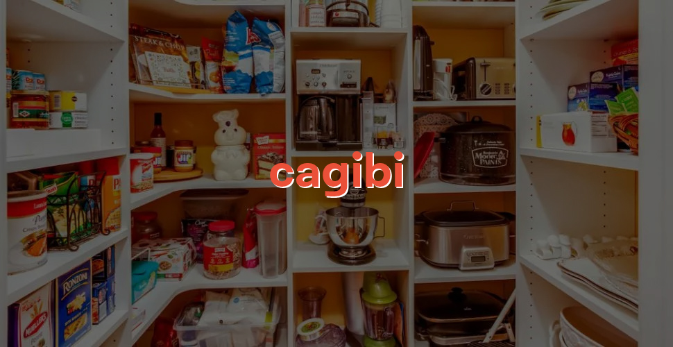

<br>



<br>

    Tiny asynchronous state management based on static data stitching

`npm i cagibi` / `yarn add cagibi`

[](https://www.npmjs.com/package/cagibi)
[](https://www.npmjs.com/package/cagibi)

Cagibi's name comes from the french word used to call a small storeroom. Pronounced `/kä'jēbē/`.

<!-- You can try live demos in the following:
[Demo 1](https://codesandbox.io/s/) |
[Demo 2](https://codesandbox.io/s/). -->

### What is `cagibi`?
- **Two main methods** to use it: `make` and `stitch`.
- **Two more methods** to use it with persisted state or through remote channels: `write` and `read`.
- **Some utilities** like `protect(target, ...keys)` to forbid changes on keys.
- And a **Patches** array-based class to help handling all patches to be stitched back into one object.
- No store.
- No complex API.
- Fully extendable.
- Intends to work with all native objects.

### When would `cagibi` come in handy?
Merging nested data structure through async channels (API, parallel threads or job queues) without willing to maintain a key-value store with primary keys linking records.


### Create a stitchable copy of your object

```js
import { make } from 'cagibi';

const profile = make({ name: 'Joe', posts: [] });
// => { name: 'Joe', posts: [] }
```

### Use your object as a reference to stitch a sub-object

```js
const post = make({ title: 'A new post' }, profile.posts);
```
### Stitch them all to get the final object
See the [runnable example here](./examples/1-readme-simple.js).

```js
import { stitch } from 'cagibi';

const stitched = stitch(profile, post);
```

Returns stitched state:
```json
{
    "name": "Joe",
    "posts": [{ "title": "A new post" }]
}
```
### Need to re-use it asynchronously or later?
See the [runnable example here](./examples/2-readme-async.js).

```js
import { make, stitch, write, read } from 'cagibi';

const stack = [];

const profile = make({ name: 'Joe', posts: [] });
const post = make({ title: 'A new post' }, profile.posts);

stack.push(write(profile));
stack.push(write(post));

// ...
// And only later on or in another environment
const profile = read(profileWritten);
const post = read(postWritten);
const stitched = stitch(profile, post);
```

Returns stitched state:
```json
{
    "name": "Joe",
    "posts": [{ "title": "A new post" }]
}
```

### Need help managing all patches?
See the [runnable example here](./examples/3-readme-patches.js).

```js
import { make, stitch, write, read, Patches } from 'cagibi';

const patches = new Patches();

const profile = make({ name: 'Joe', posts: [] });
const post = make({ title: 'A new post' }, profile.posts);

patches.push(profile, post);

const savedPatches = patches.write();

// ...
// And only later on or in another environment

const importedPatches = new Patches();
importedPatches.read(savedPatches);

const stitched = importedPatches.stitch();
```

Returns stitched state:
```json
{
    "name": "Joe",
    "posts": [{ "title": "A new post" }]
}
```
